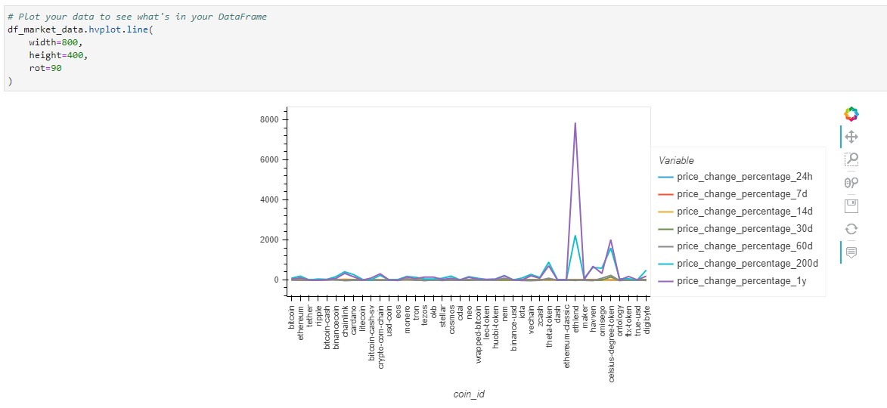
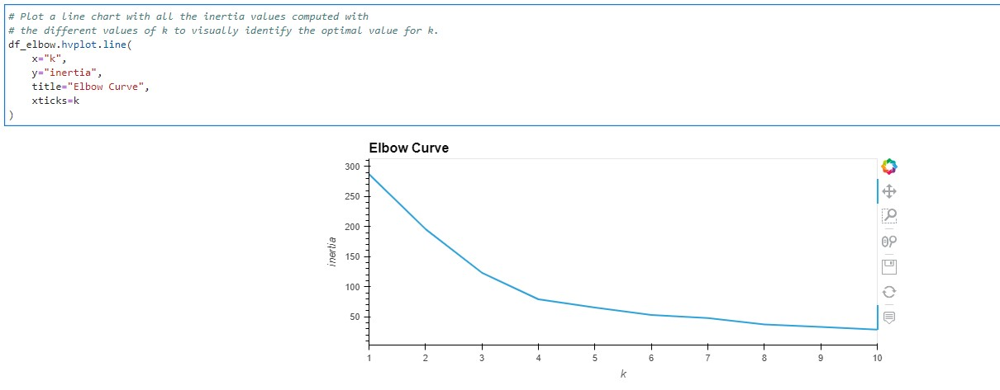
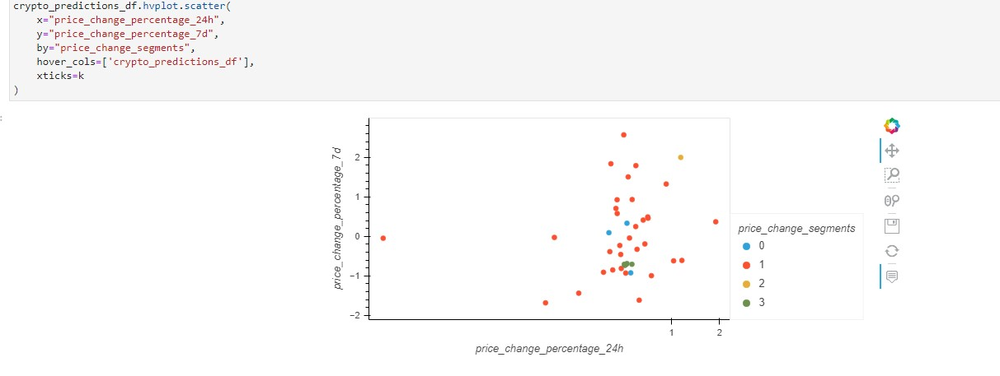

# module_10 - Crypto Clustering

Uses unsupervised learning focused on clustering data to find patterns. 

## Technologies

Pyton 3.9
Jupyter Lab and Jupyter Notebooks
Python libraries: Pandas, Pathlib, hvPlot
scikit-learn

## Usage

After loading in the data, we want to see what's in the dataframe. 

Then we prepare the data for use in using the Elbow method of finding the best value for 'k'

Now that we have the best value for 'k', we can use the KMeans algorithm to cluster the cryptocurrencies according to the price changes of the cryptocurrencies provided.

Now we Optimize Clusters with Principal Component Analysis and we repeat the process of finding the best value for 'k' and clustering. 

We can then compare the results side by side. 

## Contributors

Ryan Svendson
rsvendson@gmail.com